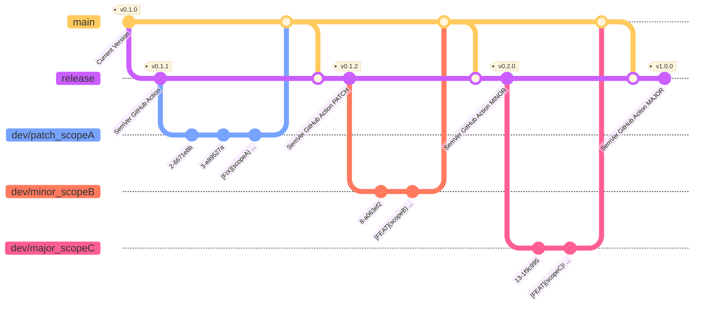

# hourglasstensorflow CI/CD - GITHUB ACTIONS

- [hourglasstensorflow CI/CD - GITHUB ACTIONS](#hourglasstensorflow-cicd---github-actions)
  - [Commit Flow](#commit-flow)
  - [Semantic Versioning](#semantic-versioning)
  - [Tags](#tags)
  - [Scope](#scope)
  - [Exclamation Breaking](#exclamation-breaking)
  - [Commit Message](#commit-message)
  - [Additional Message](#additional-message)

## Commit Flow

The Semantic Versioning is automatically trigger via [GitHub Actions](./workflows/python-release.yaml) on the `release` branch



While a PATCH/MINOR/MAJOR modification is detected after merge on `release` branch. You will need to merge you `dev` branch with the newly commited `release` branch to be up to date.

## Semantic Versioning

To automated the package versionning we establish the following convention for commits

```bash
[$TAG]($SCOPE)$! $COMMIT_MSG

$ADDITIONAL_MESSAGE
```

## Tags

The Tags **$TAGS** described the type of commit, the following tags are allowed:

- **[ADD]**: Addition to the codebase
- **[BREAK]**/**[BREAKING]**: Breaking Changes
- **[CI]**: Commit related to CI setup
- **[CONFIG]**: Commit related to project configuration
- **[DEBUG]**: Commit related to debug events
- **[DEV]**: Generic Tag
- **[DOC]**: Commit related to Documentation
- **[FEAT]**: Commit related to new feature
- **[FIX]**: Commit related to bugfix
- **[REFACTO]**: Refactor without changes on features
- **[RM]**: Deletion to the codebase
- **[TEST]**: Commit related to tests
- **[STYLE]**: Commit related to code styling *(linting/formatting)*

Multiple tags can be applied for the same commit message but only the last tag will be used to check for version bumping. We recommand to use only 1 tag or 2 MAXIMUM in case you need to explicit the content of the commit

```bash
# Example 1: GOOD
[ADD] Add __init__.py to folder

# Example 2: GOOD
[ADD][FEAT] Add new feature to codebase 

# Example 2: BAD
# in this case the version bumping from [FEAT] will not be applied
[FEAT][ADD] Add new feature to codebase 
```

Some Tags are linked to version bumping:

- **[FIX]** will apply a PATCH versioning *(e.g from x.x.2 > x.x.3)*
- **[FEAT]** will apply a MINOR versioning *(e.g from x.1.2 > x.2.0)*
- **[BREAK]**/**[BREAKING]** will apply a MAJOR versioning *(e.g from 0.1.2 > 1.0.0)*

In case these tags are used in a commit you need to place tyhem as the last tag in your commit message

## Scope

The Scope **$SCOPE** is optional but might be useful to give context about the commit

```bash
# Example 1: GOOD
[FIX](db) Correct issue with database connection

# Example 2: BAD
# Do not use whitespace in the $SCOPE
[FIX](data base) Correct issue with database connection
```

The Scope is optional but we recommend to use it as much as possible when you can

## Exclamation Breaking

In order to avoid the **[BREAK]**/**[BREAKING]** you can use an exclamation point **$!** to operate a breaking change

```bash
# Example 1: GOOD
# Use the $! operator before the :
[ADD]! Add a breaking change to the codebase

# Example 2: GOOD
# You can use the $! operator combined with a scope 
[ADD](db)! Correct issue with database connection
```

> <span style="color:green">**Note**:</span> Version Bumping Priority
>
> In the case you commit a breaking feature you might commit a message similar to `[FEAT]!: COMMIT MESSAGE`, in this case a MAJOR bumping will be applied.
> As a rule of thumb the higher priority is going from MAJOR to PATCH
>
> Be aware that a commit message like this one `[DOC]!: COMMIT MESSAGE` will apply a MAJOR version bumbing.

## Commit Message

The commit message **$COMMIT_MSG** must be a single line message to recap the main point of the commit. The commit message must be separated from the commit body by a whitespace.

```bash
# Example 1: GOOD
[ADD] Add a breaking change to the codebase

# Example 2: BAD
# You need a whitespace between the tag and the message
[ADD]Add a breaking change to the codebase
```

## Additional Message

By applying two return after the **$COMMIT_MESSAGE** you can add additional text to the commit.

```bash
# Example 1: GOOD
[ADD] Add a breaking change to the codebase\n
\n
Here is an additional text paragraph that will be used by the semantic versioning and applied to change log
```

You can also use return `\n` in the additional message

```bash
# Example 2: GOOD
[ADD] Add a breaking change to the codebase\n
\n
Here we want to display a list:\n
- This is a first point\n
- This is a second point\n
```

Last but not least you can add specification to breaking changes in the additional text. Start a line with **BREAKING CHANGE:** to describe the breaking change in detail

```bash
# Example 3: GOOD
[ADD] Add a breaking change to the codebase\n
\n
Here we want to display a list:\n
- This is a first point\n
- This is a second point\n
\n
BREAKING CHANGE: The function funcA is not working anymore\n
\n
BREAKING CHANGE: The function funcB use a new argument
```
